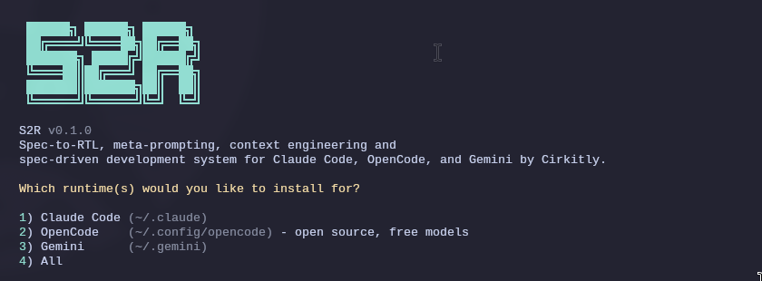

<div align="center">

# Spec2RTL

**A light-weight and powerful meta-prompting, context engineering and spec-driven development system for Claude Code, OpenCode, and Gemini CLI.**

**Solves context rot — the quality degradation that happens as Claude fills its context window.**

[](https://www.npmjs.com/package/spec2rtl-cc)
[](https://www.npmjs.com/package/spec2rtl-cc)
<!-- [](https://discord.gg/) -->
[](https://github.com/glittercowboy/spec2rtl)
[](LICENSE)

<br>

```bash
npx spec2rtl-cc
```

**Works on Mac, Windows, and Linux.**

<br>



<br>

*"If you know clearly what you want, this WILL build it for you. No bs."*

*"I've done SpecKit, OpenSpec and Taskmaster — this has produced the best results for me."*

*"By far the most powerful addition to my Claude Code. Nothing over-engineered. Literally just gets shit done."*

<br>

**Trusted by engineers at Amazon, Google, Shopify, and Webflow.**

</div>

---

## Getting Started

```bash
npx spec2rtl-cc
```

The installer prompts you to choose:
1. **Runtime** — Claude Code, OpenCode, Gemini, or all
2. **Location** — Global (all projects) or local (current project only)

Verify with `/s2r:help` inside your chosen runtime.

### Staying Updated

Spec2RTL evolves fast. Update periodically:

```bash
npx spec2rtl-cc@latest
```

<details>
<summary><strong>Non-interactive Install (Docker, CI, Scripts)</strong></summary>

```bash
# Claude Code
npx spec2rtl-cc --claude --global   # Install to ~/.claude/
npx spec2rtl-cc --claude --local    # Install to ./.claude/

# OpenCode (open source, free models)
npx spec2rtl-cc --opencode --global # Install to ~/.config/opencode/

# Gemini CLI
npx spec2rtl-cc --gemini --global   # Install to ~/.gemini/

# All runtimes
npx spec2rtl-cc --all --global      # Install to all directories
```

Use `--global` (`-g`) or `--local` (`-l`) to skip the location prompt.
Use `--claude`, `--opencode`, `--gemini`, or `--all` to skip the runtime prompt.

</details>

<details>
<summary><strong>Development Installation</strong></summary>

Clone the repository and run the installer locally:

```bash
git clone https://github.com/Cirkitly/spec2rtl.git
cd spec2rtl
node bin/install.js --claude --local
```

Installs to `./.claude/` for testing modifications before contributing.

</details>

### Recommended: Skip Permissions Mode

Spec2RTL is designed for frictionless automation. Run Claude Code with:

```bash
claude --dangerously-skip-permissions
```

> [!TIP]
> This is how Spec2RTL is intended to be used — stopping to approve `date` and `git commit` 50 times defeats the purpose.

<details>
<summary><strong>Alternative: Granular Permissions</strong></summary>

If you prefer not to use that flag, add this to your project's `.claude/settings.json`:

```json
{
  "permissions": {
    "allow": [
      "Bash(date:*)",
      "Bash(echo:*)",
      "Bash(cat:*)",
      "Bash(ls:*)",
      "Bash(mkdir:*)",
      "Bash(wc:*)",
      "Bash(head:*)",
      "Bash(tail:*)",
      "Bash(sort:*)",
      "Bash(grep:*)",
      "Bash(tr:*)",
      "Bash(git add:*)",
      "Bash(git commit:*)",
      "Bash(git status:*)",
      "Bash(git log:*)",
      "Bash(git diff:*)",
      "Bash(git tag:*)"
    ]
  }
}
```

</details>

---

## Why It Works

### Context Engineering

Claude Code is incredibly powerful *if* you give it the context it needs. Most people don't.

Spec2RTL handles it for you:

| File | What it does |
|------|--------------|
| `PROJECT.md` | Project vision, always loaded |
| `research/` | Ecosystem knowledge (stack, features, architecture, pitfalls) |
| `REQUIREMENTS.md` | Scoped v1/v2 requirements with phase traceability |
| `ROADMAP.md` | Where you're going, what's done |
| `STATE.md` | Decisions, blockers, position — memory across sessions |
| `PLAN.md` | Atomic task with XML structure, verification steps |
| `SUMMARY.md` | What happened, what changed, committed to history |
| `todos/` | Captured ideas and tasks for later work |

Size limits based on where Claude's quality degrades. Stay under, get consistent excellence.

### Multi-Agent Orchestration

Every stage uses the same pattern: a thin orchestrator spawns specialized agents, collects results, and routes to the next step.

| Stage | Orchestrator does | Agents do |
|-------|------------------|-----------|
| Research | Coordinates, presents findings | 4 parallel researchers investigate stack, features, architecture, pitfalls |
| Planning | Validates, manages iteration | Planner creates plans, checker verifies, loop until pass |
| Execution | Groups into waves, tracks progress | Executors implement in parallel, each with fresh 200k context |
| Verification | Presents results, routes next | Verifier checks codebase against goals, debuggers diagnose failures |

The orchestrator never does heavy lifting. It spawns agents, waits, integrates results.

**The result:** You can run an entire phase — deep research, multiple plans created and verified, thousands of lines of code written across parallel executors, automated verification against goals — and your main context window stays at 30-40%. The work happens in fresh subagent contexts. Your session stays fast and responsive.

### Atomic Git Commits

Each task gets its own commit immediately after completion:

```bash
abc123f docs(08-02): complete user registration plan
def456g feat(08-02): add email confirmation flow
hij789k feat(08-02): implement password hashing
lmn012o feat(08-02): create registration endpoint
```

> [!NOTE]
> **Benefits:** Git bisect finds exact failing task. Each task independently revertable. Clear history for Claude in future sessions. Better observability in AI-automated workflow.

Every commit is surgical, traceable, and meaningful.

### Modular by Design

- Add phases to current milestone
- Insert urgent work between phases
- Complete milestones and start fresh
- Adjust plans without rebuilding everything

You're never locked in. The system adapts.

---

## Commands

### Core Workflow

| Command | What it does |
|---------|--------------|
| `/s2r:new-project` | Full initialization: questions → research → requirements → roadmap |
| `/s2r:discuss-phase [N]` | Capture implementation decisions before planning |
| `/s2r:plan-phase [N]` | Research + plan + verify for a phase |
| `/s2r:execute-phase <N>` | Execute all plans in parallel waves, verify when complete |
| `/s2r:verify-work [N]` | Manual user acceptance testing ¹ |
| `/s2r:audit-milestone` | Verify milestone achieved its definition of done |
| `/s2r:complete-milestone` | Archive milestone, tag release |
| `/s2r:new-milestone [name]` | Start next version: questions → research → requirements → roadmap |

### Navigation

| Command | What it does |
|---------|--------------|
| `/s2r:progress` | Where am I? What's next? |
| `/s2r:help` | Show all commands and usage guide |
| `/s2r:update` | Update Spec2RTL with changelog preview |
| `/s2r:join-discord` | Join the Spec2RTL Discord community |

### Brownfield

| Command | What it does |
|---------|--------------|
| `/s2r:map-codebase` | Analyze existing codebase before new-project |

### Phase Management

| Command | What it does |
|---------|--------------|
| `/s2r:add-phase` | Append phase to roadmap |
| `/s2r:insert-phase [N]` | Insert urgent work between phases |
| `/s2r:remove-phase [N]` | Remove future phase, renumber |
| `/s2r:list-phase-assumptions [N]` | See Claude's intended approach before planning |
| `/s2r:plan-milestone-gaps` | Create phases to close gaps from audit |

### Session

| Command | What it does |
|---------|--------------|
| `/s2r:pause-work` | Create handoff when stopping mid-phase |
| `/s2r:resume-work` | Restore from last session |

### Utilities

| Command | What it does |
|---------|--------------|
| `/s2r:settings` | Configure model profile and workflow agents |
| `/s2r:set-profile <profile>` | Switch model profile (quality/balanced/budget) |
| `/s2r:add-todo [desc]` | Capture idea for later |
| `/s2r:check-todos` | List pending todos |
| `/s2r:debug [desc]` | Systematic debugging with persistent state |
| `/s2r:quick` | Execute ad-hoc task with Spec2RTL guarantees |

<sup>¹ Contributed by reddit user OracleGreyBeard</sup>

---

## Configuration

Spec2RTL stores project settings in `.planning/config.json`. Configure during `/s2r:new-project` or update later with `/s2r:settings`.

### Core Settings

| Setting | Options | Default | What it controls |
|---------|---------|---------|------------------|
| `mode` | `yolo`, `interactive` | `interactive` | Auto-approve vs confirm at each step |
| `depth` | `quick`, `standard`, `comprehensive` | `standard` | Planning thoroughness (phases × plans) |

### Model Profiles

Control which Claude model each agent uses. Balance quality vs token spend.

| Profile | Planning | Execution | Verification |
|---------|----------|-----------|--------------|
| `quality` | Opus | Opus | Sonnet |
| `balanced` (default) | Opus | Sonnet | Sonnet |
| `budget` | Sonnet | Sonnet | Haiku |

Switch profiles:
```
/s2r:set-profile budget
```

Or configure via `/s2r:settings`.

### Workflow Agents

These spawn additional agents during planning/execution. They improve quality but add tokens and time.

| Setting | Default | What it does |
|---------|---------|--------------|
| `workflow.research` | `true` | Researches domain before planning each phase |
| `workflow.plan_check` | `true` | Verifies plans achieve phase goals before execution |
| `workflow.verifier` | `true` | Confirms must-haves were delivered after execution |

Use `/s2r:settings` to toggle these, or override per-invocation:
- `/s2r:plan-phase --skip-research`
- `/s2r:plan-phase --skip-verify`

### Execution

| Setting | Default | What it controls |
|---------|---------|------------------|
| `parallelization.enabled` | `true` | Run independent plans simultaneously |
| `planning.commit_docs` | `true` | Track `.planning/` in git |

### Git Branching

Control how Spec2RTL handles branches during execution.

| Setting | Options | Default | What it does |
|---------|---------|---------|--------------|
| `git.branching_strategy` | `none`, `phase`, `milestone` | `none` | Branch creation strategy |
| `git.phase_branch_template` | string | `s2r/phase-{phase}-{slug}` | Template for phase branches |
| `git.milestone_branch_template` | string | `s2r/{milestone}-{slug}` | Template for milestone branches |

**Strategies:**
- **`none`** — Commits to current branch (default Spec2RTL behavior)
- **`phase`** — Creates a branch per phase, merges at phase completion
- **`milestone`** — Creates one branch for entire milestone, merges at completion

At milestone completion, Spec2RTL offers squash merge (recommended) or merge with history.

---

## Troubleshooting

**Commands not found after install?**
- Restart Claude Code to reload slash commands
- Verify files exist in `~/.claude/commands/s2r/` (global) or `./.claude/commands/s2r/` (local)

**Commands not working as expected?**
- Run `/s2r:help` to verify installation
- Re-run `npx spec2rtl-cc` to reinstall

**Updating to the latest version?**
```bash
npx spec2rtl-cc@latest
```

**Using Docker or containerized environments?**

If file reads fail with tilde paths (`~/.claude/...`), set `CLAUDE_CONFIG_DIR` before installing:
```bash
CLAUDE_CONFIG_DIR=/home/youruser/.claude npx spec2rtl-cc --global
```
This ensures absolute paths are used instead of `~` which may not expand correctly in containers.

### Uninstalling

To remove Spec2RTL completely:

```bash
# Global installs
npx spec2rtl-cc --claude --global --uninstall
npx spec2rtl-cc --opencode --global --uninstall

# Local installs (current project)
npx spec2rtl-cc --claude --local --uninstall
npx spec2rtl-cc --opencode --local --uninstall
```

This removes all Spec2RTL commands, agents, hooks, and settings while preserving your other configurations.

---

## License

MIT License. See [LICENSE](LICENSE) for details.

---

<div align="center">

**Claude Code is powerful. Spec2RTL makes it reliable.**

</div>
